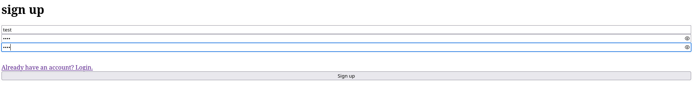
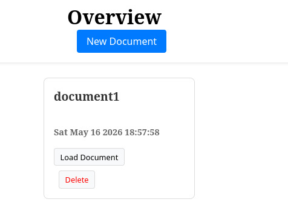
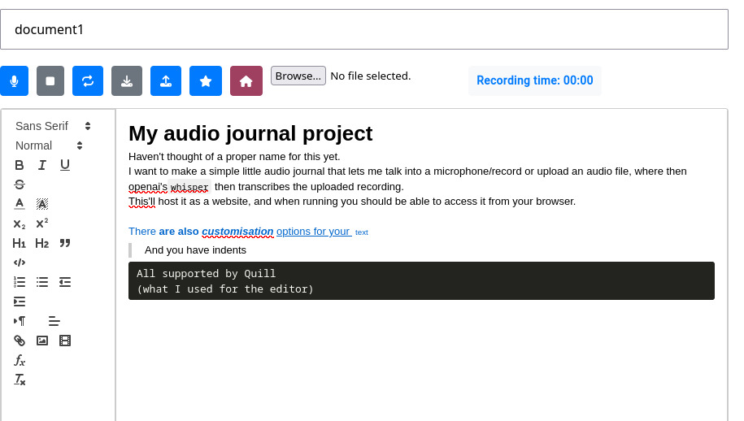
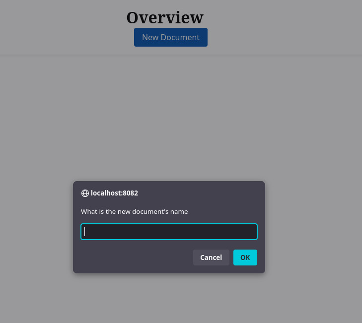

# Audio dictation document editor

Images:





Open source, simple dictation software, that uses OpenAI's whisper to allow you to dictate a document, transcribing your words from speech to text.
Uses Quill for the editor

Installation instructions:
Use:
```bash
uv sync
```
in order to install the dependencies. 

Use:
```bash
uv run app.py
```
To run the application.

You can run it using docker aswell, by using:
```bash
docker compose up
```
To run the application on port 8082.

